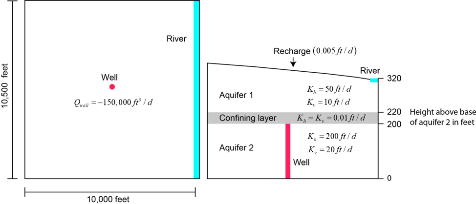

# Advanced Modeling of Groundwater Flow (GW3099)

# FLOPY EXERCISES

## EXERCISE 1
Example 1 is based on the groundwater flow system shown below. The flow system consists of two aquifers separated by a thin low conductivity confining layer.

The system is simulated with a traditional structured model grid consisting of 3 model layers, 21 rows, and 20 columns (figure 2). Areal grid cells are uniform square cells, 500 feet per side. The model layers correspond to the hydrogeologic units shown in the figure above.

The well is located in row 11, column 10, and layer 3. The river is located in layer 1, column 20, rows 1 - 21.

The purpose of this problem is to become familiar with Flopy by creating Example Problem 1 within a jupyter notebook and running MODFLOW-2005, MODPATH-7, and MT3DMS, and then post-processing the results.

Concepts to focus on for this exercise:
1. Using the jupyter notebook
2. Creating a MODFLOW-2005 model
3. Creating a MODPATH-7 model
4. Creating a MT3DMS model

