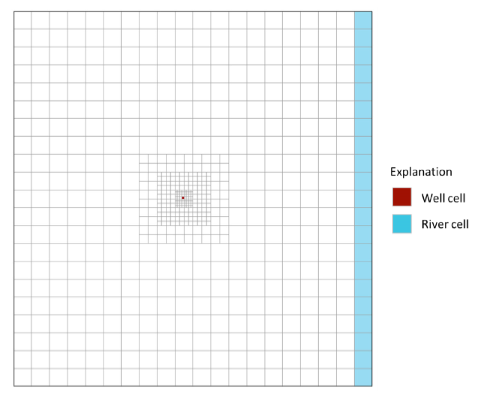

# Advanced Modeling of Groundwater Flow (GW3099)

# MODFLOW 6 EXERCISES

## EXERCISE 1
Example 1 is based on the groundwater flow system shown below. The flow system consists of two aquifers separated by a thin low conductivity confining layer.

The system is simulated with a traditional structured model grid consisting of 3 model layers, 21 rows, and 20 columns (figure 2). Areal grid cells are uniform square cells, 500 feet per side. The model layers correspond to the hydrogeologic units shown in the figure above.

The well is located in row 11, column 10, and layer 3. The river is located in layer 1, column 20, rows 1 - 21.

The purpose of this problem is to become familiar with the MODFLOW 6 input files by creating the files by hand for Example Problem 1.  This requires creating the following files: mfsim.nam, ex02.tdis, ex02.ims, ex02.nam, ex02.dis, ex02.npf, ex02.ic, ex02.wel, ex02.riv, ex02.rch, ex02.oc.

Concepts to focus on for this exercise:
1. Simulation Name File (mfsim.nam)
2. Discretization (DIS) Package
    * Regular MODFLOW grid with layers, rows, and columns
    * Input file structure
    * LAYERED Keyword
3. Node Property Flow (NPF) Package
4. Boundary Packages
    * WEL, RIV, RCH
    * Become familiar with the BEGIN PERIOD iper block
    * Understand the READASARRAYS options for the RCH Package (and EVT) Package
5. Solver Package (IMS)
6. Output Control Package (OC)
7. Output Files
    * mfsim.lst, gwf.lst, ex02.dis.grb, ex02.hds, ex02.cbc

The sequence of steps will be as follows:
1. Create the input files
2. Run the model
3. View the results with Model Viewer
4. Load and plot the model in a jupyter notebook using Flopy
5. Learn to use the OPEN/CLOSE keyword to enter a spatially variable hydraulic conductivity array
6. Split the RIV Package into two packages

## EXERCISE 2

## EXERCISE 3

## EXERCISE 4

Exercise 4 simulates the same groundwater flow system as in the first exercise except an unstructured grid is used to refine the area near the well. The figure below shows the unstructured grid, which is based on the structured grid used in example 1 (referred to as the base grid). The areal grid is refined around the base-grid location that contains the well in example 1 (row 11, column 10). The base-grid cell containing the well is refined three levels, which means that the unstructured grid contains an 8 x 8 array of 64 cells in place of the original base-grid cell. The grid is smoothed so that it will meet the requirements of MODPATH for unstructured grids. The same areal grid is used for all model layers. The three-layer unstructured grid contains a total of 1,953 cells. The well is located in layer 3 near the center of the cell containing the base-grid well.

In this exercise we will use the GRIDGEN program to create the quadtree grid.

## EXERCISE 5

## EXERCISE 6

## EXERCISE 7

