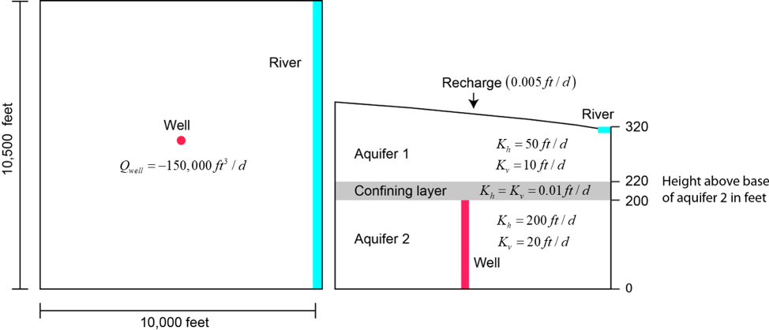
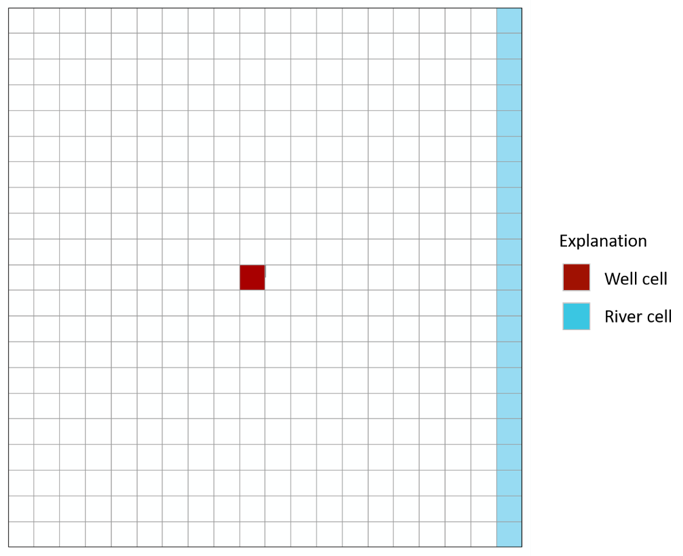

# Advanced Modeling of Groundwater Flow (GW3099)

# MODFLOW 6 EXERCISES

## EXERCISE 1
Example 1 is based on the groundwater flow system shown below. The flow system consists of two aquifers separated by a thin low conductivity confining layer.

The system is simulated with a traditional structured model grid consisting of 3 model layers, 21 rows, and 20 columns (figure 2). Areal grid cells are uniform square cells, 500 feet per side. The model layers correspond to the hydrogeologic units shown in the figure above.

The well is located in row 11, column 10, and layer 3. The river is located in layer 1, column 20, rows 1 - 21.

The purpose of this problem is to become familiar with the MODFLOW 6 input files by creating the files by hand for Example Problem 1.  This requires creating the following files: mfsim.nam, ex02.tdis, ex02.ims, ex02.nam, ex02.dis, ex02.npf, ex02.ic, ex02.wel, ex02.riv, ex02.rch, ex02.oc.

Concepts to focus on for this exercise:
1. Simulation Name File (mfsim.nam)
2. Discretization (DIS) Package
    * Regular MODFLOW grid with layers, rows, and columns
    * Input file structure
    * LAYERED Keyword
3. Node Property Flow (NPF) Package
4. Boundary Packages
5. Solver Package (IMS)
6. Output Control Package (OC)
7. Output Files

The sequence of steps will be as follows:
1. Create the input files
2. Run the model
3. View the results with Model Viewer
4. Load and plot the model in a jupyter notebook using Flopy

## EXERCISE 2

## EXERCISE 3

## EXERCISE 4

## EXERCISE 5

## EXERCISE 6

## EXERCISE 7

